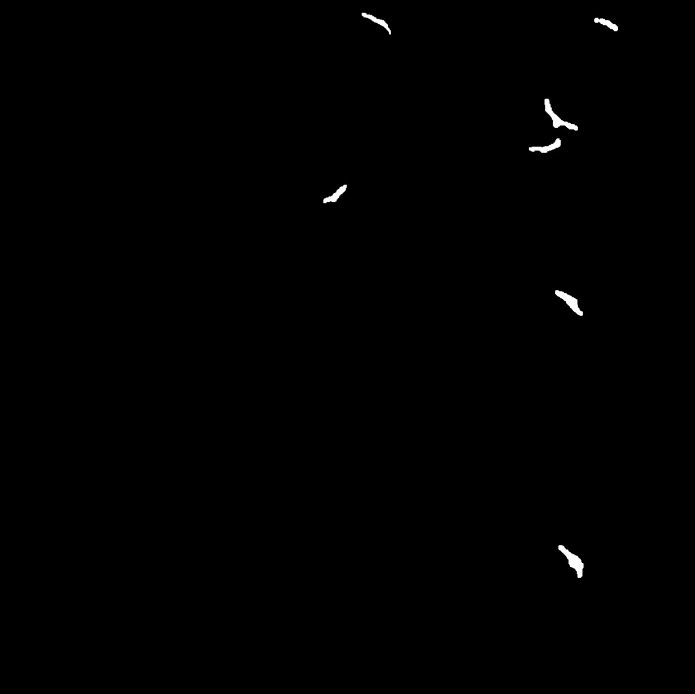
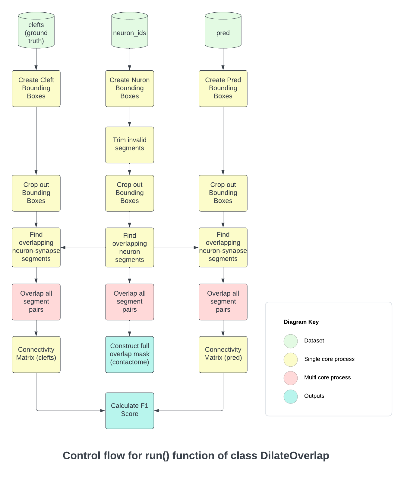

# Connectomics research library, Kasthuri Lab, UChicago

### Author: Surya Chandra Kalia
### Advisors: Kevin Boergens, Narayan (Bobby) Kasthuri
### Time: Summer 2023

## Introduction:

This Python library was developed to aid connectomics research. Our focus here is on the evaluation of synapse detection models. The output of a synapse detection model would usually be a mask or heatmap over a 3D voxel space. 


<p align="center">

</p>
<!--  -->

Given a ground truth annotation, we conventionally used the IOU (intersection over union) metric for evaluating object detection and segmentation models. This essentially measures the overlap of the prediction and ground truth as a fraction of the union of the two volumes. Here is an example of this metric used in 2D images:

<p align="center">

</p>
<!--  -->

(Source : learnopencv.com)


While this is a simple and convenient evaluation metric, it can be a bit too strict and rigid for the context of connectomics. This is because our end goal is to reconstruct the connectome by identifying the correct points of synapse contacts between the 3D segmented neurons. For this reconstruction task, we are not concerned with the accurate replication of the synapse shape. Instead, we just need to ensure that the synapse predictions correctly identify the neuron segments that are connected by that synapse.


Using this library, we can construct the connectivity matrix across neuron segments given the synapse ground truth/prediction. Given the connectivity matrix, we calculate the F1 score to quantitatively comment on the accuracy of the predictions based on how well they help reconstruct the connectome.

## Setup

### Installation

All conda dependencies are specified in `environment.yml` which can be imported directly using:

```
conda env create -f environment.yml
```

This will create a conda env named `gpu_torch`. Activate the environment using the following command:
```
conda activate gpu_torch
```

Source : https://conda.io/projects/conda/en/latest/user-guide/tasks/manage-environments.html#creating-an-environment-from-an-environment-yml-file

> [!NOTE]
> In case the pip requirements don't get installed during the conda env creation, there is a requirements.txt file available for manual installation. This can be done by activating the conda env and running the following command:  pip3 install -r requirements.txt

### Dataset download

Download the cropped version of the CREMI dataset available here: https://cremi.org/data/

The path to the downloaded file should be set as the `cremi_file_path` argument when running the code. The following is an example of the filepath to the hdf file:

```
cremi_file_path = /home/suryakalia/documents/summer/datasets/cremi/sample_A_20160501.hdf
```

### [OPTIONAL] Predictions

In order to be able to calculate the F1 scores, we would need to have a synapse prediction file containing the synapse annotations as segmentations (i.e. each synapse region labelled with a unique ID)

This would be in the form of an int/uint numpy array with dimenstions identical to that of CREMI dataset's `clefts` volume. The expected axes format for the numpy array is (z, y, x) and this is to be compressed as aan lzma file (.xz)

As an example, one sample is provided in the repo with the filename `result_A_components.xz`. This would be passed in as the optional `pred_path` argument when initializing the `DilateOverlap` class

If needed, you can inspect lzma files using pickle as follows:

```
import lzma
import pickle
import numpy as np

with lzma.open("result_A_components.xz", "rb") as f:
  pred_img = pickle.load(f)

print(pred_img.shape)
```

## Execution

A sample execution script can be found here: `test/test.py`. This script will run the full pipeline of execution end-to-end. Please add the correct paths for sys path (test.py:15) as well as the paths for the input file and output directory. The construtor arguments provided to the class are as follows:

1. `cremi_file_path` : File path to the cropped CREMI hdf file.
2. `output_dir` : Directory where all outputs will be generated.
3. `dilation_voxel_count` : Number of voxels by which the segmentation volumes will be dilated. The library supports anisotropic dilations. Since EM images have much lower resolution in the z-component (~10x lower), we fix the dilation in the z direction to 1 voxel, and apply the `dilation_voxel_count` across x & y directions.
4. `voxel_volume_threshold` : Minimum voxel count, under which, segmentations will be filtered out. This is helpful to eliminate small spurious segmentation patches for neuron processes. This does not filter out any synapse instances. 
5. `num_cores` : The library supports multiprocessing for the most time consuming steps of overlapping segmentation pairs. Ensure that the number of cores available are more than the value being set here. Recommended to use 20+ cores for faster processing.
6. `pred_path` : [OPTIONAL] Path to synapse predictions in the form of a lzma pickled numpy array. Can use the provided `result_A_components.xz` as an example if using CREMI_A dataset.

## Outputs

The end objective is to get an estimate of how good are the synapse predictions from a connectome generation perspective. The following is a sample output on stdout at the end of the processing step:

```
Connectivity Matrix Size =  4520
Precision =  0.4435674822415154
Recall =  0.9656357388316151
F1 score =  0.6078961600865332
```

Here we are looking at a binary neuron connectivity matrix of 4520 segments. The tool generates the connectivity matrices using the ground truth and predicted synapses, and evaluates the Precision, Recall and F1 scores based on the two connectivity matrices. 

Apart from the above console output, there are multiple output files and directories generates in the `output_dir`. The semantics of these intermediate outputs are explained in the execution pipeline below.

## Control Flow

Below is an overview of what goes on under the hood when executing `run()`

<p align="center">

</p>

<!--  -->

## Helper scripts

Cleanup script
Helper scripts - create hdf file, upload webknossos, analyse synapse overlaps

